# Схема базы данных Construction Technical Docs Service

## Визуальная схема (Mermaid)

```mermaid
erDiagram
    USER ||--o{ PROJECT_USERS : "участвует в"
    USER ||--o{ AUTH_SESSION : "имеет сессии"
    USER ||--o{ PROJECT : "владеет проектами"
    USER ||--o{ PROJECT_SHARE : "делится проектами"
    
    PROJECT ||--o{ PROJECT_USERS : "имеет участников"
    PROJECT ||--o{ DOCUMENT : "содержит документы"
    PROJECT ||--o{ DRAWING : "содержит чертежи"
    PROJECT ||--o{ ESTIMATE : "содержит сметы"
    PROJECT ||--o{ MATERIAL_DRAWING : "содержит материалы"
    PROJECT ||--o{ REPORT : "содержит отчёты"
    
    DOCUMENT ||--o{ DRAWING : "содержит чертежи"
    DOCUMENT ||--o{ MATERIAL_DRAWING : "ссылается на материалы"
    DOCUMENT ||--o{ REPORT : "ссылается на отчёты"
    
    DRAWING ||--o{ MATERIAL_DRAWING : "имеет материалы"
    DRAWING ||--o{ DRAWING_CALCULATION : "имеет расчёты"
    DRAWING ||--o{ REPORT : "содержит в отчётах"
    
    MATERIAL ||--o{ MATERIAL_DRAWING : "используется в"
    
    ESTIMATE ||--o{ ESTIMATE_ITEM : "содержит элементы"
    DRAWING_CALCULATION ||--o{ ESTIMATE_ITEM : "входит в смету"
    
    USER {
        int id PK
        string first_name
        string middle_name
        string last_name
        string username UK
        string password_hash
        string phone
        string email
        string photo_url
    }
    
    AUTH_SESSION {
        int id PK
        int user_id FK
        string session_key UK
        datetime created_at
        datetime expires_at
    }
    
    PROJECT {
        int id PK
        int owner_id FK
        string name
        text description
        string address
        text work_scope
        date start_date
        date end_date
    }
    
    PROJECT_USERS {
        int id PK
        int user_id FK
        int project_id FK
        string access_rights
        date created_at
    }
    
    PROJECT_SHARE {
        int id PK
        int project_id FK
        int owner_id FK
        int shared_with_id FK
        string access_level
        date shared_at
    }
    
    DOCUMENT {
        int id PK
        int project_id FK
        string doc_type
        string category
        date created_at
        string name
        string file_path
        string file_hash
        int page_count
    }
    
    DRAWING {
        int id PK
        int document_id FK
        int project_id FK
        string number
        string name
        string type
        string scale
        float area
        int page_number
    }
    
    MATERIAL {
        int id PK
        string type
        string name
        float price
        string mark
    }
    
    MATERIAL_DRAWING {
        int id PK
        int material_id FK
        int document_id FK
        int drawing_id FK
        int project_id FK
        float quantity_on_drawing
        float cost_on_drawing
    }
    
    REPORT {
        int id PK
        int material_drawing_id FK
        int material_id FK
        int drawing_id FK
        int document_id FK
        int project_id FK
        string view
        float total_cost
        float total_quantity
    }
    
    DRAWING_CALCULATION {
        int id PK
        int drawing_id FK
        int project_id FK
        string element_name
        string element_type
        float quantity
        string unit
        text calculation_result
        datetime created_at
    }
    
    ESTIMATE {
        int id PK
        int project_id FK
        string name
        text description
        float total_cost
        float total_quantity
        datetime created_at
        datetime updated_at
    }
    
    ESTIMATE_ITEM {
        int id PK
        int estimate_id FK
        int drawing_calculation_id FK
        float quantity
        float unit_cost
        float total_cost
    }
```



---

## Таблицы базы данных

### 1. **users** - Пользователи системы

| Поле | Тип | Описание |
|------|-----|----------|
| `id` | INTEGER | Первичный ключ (автоинкремент) |
| `first_name` | VARCHAR(100) | Имя |
| `middle_name` | VARCHAR(100) | Отчество (опционально) |
| `last_name` | VARCHAR(100) | Фамилия |
| `username` | VARCHAR(100) | Уникальное имя пользователя (INDEX) |
| `password_hash` | VARCHAR(255) | Хеш пароля |
| `phone` | VARCHAR(50) | Телефон (опционально) |
| `email` | VARCHAR(255) | Email (опционально) |
| `photo_url` | VARCHAR(1024) | URL аватара (опционально) |

---

### 2. **auth_sessions** - Сессии авторизации

| Поле | Тип | Описание |
|------|-----|----------|
| `id` | INTEGER | Первичный ключ |
| `user_id` | INTEGER | Ссылка на users.id (FOREIGN KEY, ON DELETE CASCADE) |
| `session_key` | VARCHAR(255) | Уникальный ключ сессии (UNIQUE, INDEX) |
| `created_at` | DATETIME | Дата создания сессии |
| `expires_at` | DATETIME | Дата истечения сессии |

---

### 3. **projects** - Проекты

| Поле | Тип | Описание |
|------|-----|----------|
| `id` | INTEGER | Первичный ключ (автоинкремент) |
| `owner_id` | INTEGER | Владелец проекта (FOREIGN KEY на users.id) |
| `name` | VARCHAR(255) | Название проекта |
| `description` | TEXT | Описание (опционально) |
| `address` | VARCHAR(255) | Адрес объекта (опционально) |
| `work_scope` | TEXT | Объем работ (опционально) |
| `start_date` | DATE | Дата начала (опционально) |
| `end_date` | DATE | Дата окончания (опционально) |

---

### 4. **project_users** - Участники проекта (Many-to-Many)

| Поле | Тип | Описание |
|------|-----|----------|
| `id` | INTEGER | Первичный ключ |
| `user_id` | INTEGER | Ссылка на users.id (FOREIGN KEY, ON DELETE CASCADE) |
| `project_id` | INTEGER | Ссылка на projects.id (FOREIGN KEY, ON DELETE CASCADE) |
| `access_rights` | VARCHAR(255) | Права доступа (read/write/admin) |
| `created_at` | DATE | Дата добавления в проект |

---

### 5. **project_shares** - Совместный доступ к проектам

| Поле | Тип | Описание |
|------|-----|----------|
| `id` | INTEGER | Первичный ключ |
| `project_id` | INTEGER | Ссылка на projects.id (FOREIGN KEY) |
| `owner_id` | INTEGER | Владелец доступа (FOREIGN KEY на users.id) |
| `shared_with_id` | INTEGER | Пользователь, которому предоставлен доступ (FOREIGN KEY) |
| `access_level` | VARCHAR(50) | Уровень доступа ('read', 'write', 'admin') |
| `shared_at` | DATE | Дата предоставления доступа |

---

### 6. **documents** - Документы

| Поле | Тип | Описание |
|------|-----|----------|
| `id` | INTEGER | Первичный ключ (автоинкремент) |
| `project_id` | INTEGER | Ссылка на projects.id (FOREIGN KEY, ON DELETE CASCADE) |
| `doc_type` | VARCHAR(100) | Тип документа (спецификация, чертеж, смета) |
| `category` | VARCHAR(100) | Категория документа (классификация) - **3.1.1** |
| `created_at` | DATE | Дата создания |
| `name` | VARCHAR(255) | Название документа |
| `file_path` | VARCHAR(1024) | Путь к файлу в MinIO |
| `file_hash` | VARCHAR(255) | Хеш файла для проверки целостности |
| `page_count` | INTEGER | Количество страниц в PDF |

---

### 7. **drawings** - Чертежи

| Поле | Тип | Описание |
|------|-----|----------|
| `id` | INTEGER | Первичный ключ (автоинкремент) |
| `document_id` | INTEGER | Ссылка на documents.id (FOREIGN KEY) |
| `project_id` | INTEGER | Ссылка на projects.id (FOREIGN KEY) |
| `number` | VARCHAR(100) | Обозначение чертежа |
| `name` | VARCHAR(255) | Название чертежа |
| `type` | VARCHAR(100) | Тип (электрика, вентиляция, и т.д.) |
| `scale` | VARCHAR(50) | Масштаб |
| `area` | FLOAT | Площадь |
| `page_number` | INTEGER | Номер страницы в PDF - **3.1.5** |

---

### 8. **materials** - Материалы и оборудование

| Поле | Тип | Описание |
|------|-----|----------|
| `id` | INTEGER | Первичный ключ (автоинкремент) |
| `type` | VARCHAR(100) | Тип материала (cable, fixture, device) - **3.1.3** |
| `name` | VARCHAR(255) | Название материала |
| `price` | FLOAT | Цена за единицу |
| `mark` | VARCHAR(255) | Марка/артикул |

---

### 9. **material_drawings** - Материалы в чертежах

| Поле | Тип | Описание |
|------|-----|----------|
| `id` | INTEGER | Первичный ключ |
| `material_id` | INTEGER | Ссылка на materials.id |
| `document_id` | INTEGER | Ссылка на documents.id |
| `drawing_id` | INTEGER | Ссылка на drawings.id |
| `project_id` | INTEGER | Ссылка на projects.id |
| `quantity_on_drawing` | FLOAT | Количество на чертеже |
| `cost_on_drawing` | FLOAT | Стоимость на чертеже |

---

### 10. **reports** - Отчёты

| Поле | Тип | Описание |
|------|-----|----------|
| `id` | INTEGER | Первичный ключ |
| `material_drawing_id` | INTEGER | Ссылка на material_drawings.id |
| `material_id` | INTEGER | Ссылка на materials.id |
| `drawing_id` | INTEGER | Ссылка на drawings.id |
| `document_id` | INTEGER | Ссылка на documents.id |
| `project_id` | INTEGER | Ссылка на projects.id |
| `view` | VARCHAR(100) | Вид отчёта |
| `total_cost` | FLOAT | Общая стоимость |
| `total_quantity` | FLOAT | Общее количество |

---

### 11. **drawing_calculations** - Расчёты элементов чертежа - **3.1.3, 3.1.4**

| Поле | Тип | Описание |
|------|-----|----------|
| `id` | INTEGER | Первичный ключ (автоинкремент) |
| `drawing_id` | INTEGER | Ссылка на drawings.id |
| `project_id` | INTEGER | Ссылка на projects.id |
| `element_name` | VARCHAR(255) | Название элемента |
| `element_type` | VARCHAR(100) | Тип элемента |
| `quantity` | FLOAT | Количество |
| `unit` | VARCHAR(50) | Единица измерения (м, шт, кг) |
| `calculation_result` | TEXT | Результат расчета/формула |
| `created_at` | DATETIME | Дата создания |

---

### 12. **estimates** - Сметы - **3.1.2, 3.1.6**

| Поле | Тип | Описание |
|------|-----|----------|
| `id` | INTEGER | Первичный ключ (автоинкремент) |
| `project_id` | INTEGER | Ссылка на projects.id |
| `name` | VARCHAR(255) | Название сметы |
| `description` | TEXT | Описание (опционально) |
| `total_cost` | FLOAT | Общая стоимость |
| `total_quantity` | FLOAT | Общее количество |
| `created_at` | DATETIME | Дата создания |
| `updated_at` | DATETIME | Дата последнего обновления |

---

### 13. **estimate_items** - Элементы сметы - **3.1.6**

| Поле | Тип | Описание |
|------|-----|----------|
| `id` | INTEGER | Первичный ключ |
| `estimate_id` | INTEGER | Ссылка на estimates.id |
| `drawing_calculation_id` | INTEGER | Ссылка на drawing_calculations.id |
| `quantity` | FLOAT | Количество |
| `unit_cost` | FLOAT | Стоимость единицы |
| `total_cost` | FLOAT | Общая стоимость (quantity × unit_cost) |

---

## Связи между таблицами

### User → Project (Один-ко-многим)
- Один пользователь может владеть несколькими проектами
- `projects.owner_id` → `users.id`

### User ↔ Project (Многие-ко-многим)
- Через таблицу `project_users`
- Пользователи могут участвовать в нескольких проектах с разными правами

### Project → Document (Один-ко-многим)
- Один проект содержит много документов
- `documents.project_id` → `projects.id`

### Document → Drawing (Один-ко-многим)
- Один документ содержит много чертежей
- `drawings.document_id` → `documents.id`

### Drawing → DrawingCalculation (Один-ко-многим)
- Один чертёж имеет много расчётов элементов
- `drawing_calculations.drawing_id` → `drawings.id`

### Estimate → EstimateItem (Один-ко-многим)
- Одна смета содержит много элементов
- `estimate_items.estimate_id` → `estimates.id`

### DrawingCalculation → EstimateItem (Один-ко-многим)
- Один расчёт может входить в несколько элементов сметы
- `estimate_items.drawing_calculation_id` → `drawing_calculations.id`

---

## Индексы

| Таблица | Поле | Тип |
|---------|------|-----|
| users | id | PRIMARY KEY |
| users | username | UNIQUE INDEX |
| projects | id | PRIMARY KEY |
| projects | owner_id | INDEX |
| documents | id | PRIMARY KEY |
| documents | project_id | INDEX |
| drawings | id | PRIMARY KEY |
| drawings | document_id | INDEX |
| drawings | project_id | INDEX |
| materials | id | PRIMARY KEY |
| materials | type | INDEX |
| estimates | id | PRIMARY KEY |
| estimates | project_id | INDEX |
| drawing_calculations | id | PRIMARY KEY |
| drawing_calculations | drawing_id | INDEX |
| auth_sessions | session_key | UNIQUE INDEX |

---

## Реализация функций ТЗ 3.1

### 3.1.1 Классификация документации по категориям
- ✅ Поле `documents.category` VARCHAR(100)
- ✅ Фильтрация через API

### 3.1.2 Возможность составления сметы
- ✅ Таблица `estimates` для смет
- ✅ Таблица `estimate_items` для элементов
- ✅ Поле `materials.price` для стоимости

### 3.1.3 Выбор элементов чертежа
- ✅ Таблица `drawing_calculations`
- ✅ Поле `drawing_calculations.element_type`

### 3.1.4 Получение расчёта элементов чертежа
- ✅ Поле `drawing_calculations.calculation_result`
- ✅ CRUD операции через API

### 3.1.5 Выбор страницы чертежа
- ✅ Поле `drawings.page_number` INTEGER
- ✅ Связь с PDF страницей

### 3.1.6 Объединение расчётов смет
- ✅ Метод `EstimateCRUD.merge_estimates()`
- ✅ Объединение через `estimate_items`

---

## Примеры SQL запросов

### Получить все материалы проекта
```sql
SELECT m.name, m.mark, m.price, 
       SUM(md.quantity_on_drawing) as total_quantity,
       SUM(md.cost_on_drawing) as total_cost
FROM materials m
JOIN material_drawings md ON m.id = md.material_id
WHERE md.project_id = 1
GROUP BY m.id;
```

### Получить смету с элементами
```sql
SELECT e.name, e.total_cost,
       dc.element_name, dc.quantity, dc.unit,
       ec.quantity as item_quantity, ec.total_cost as item_cost
FROM estimates e
JOIN estimate_items ec ON e.id = ec.estimate_id
JOIN drawing_calculations dc ON ec.drawing_calculation_id = dc.id
WHERE e.id = 1;
```

### Получить документы по категории
```sql
SELECT name, doc_type, category, page_count
FROM documents
WHERE project_id = 1 AND category = 'specification';
```

### Объединённая смета из нескольких смет
```sql
SELECT e1.name as estimate_name, e1.total_cost,
       e2.name as merged_estimate, e2.total_cost as merged_cost
FROM estimates e1
JOIN estimate_items ei ON e1.id = ei.estimate_id
JOIN estimates e2 ON ei.estimate_id = e2.id
WHERE e2.id = 1;
```
